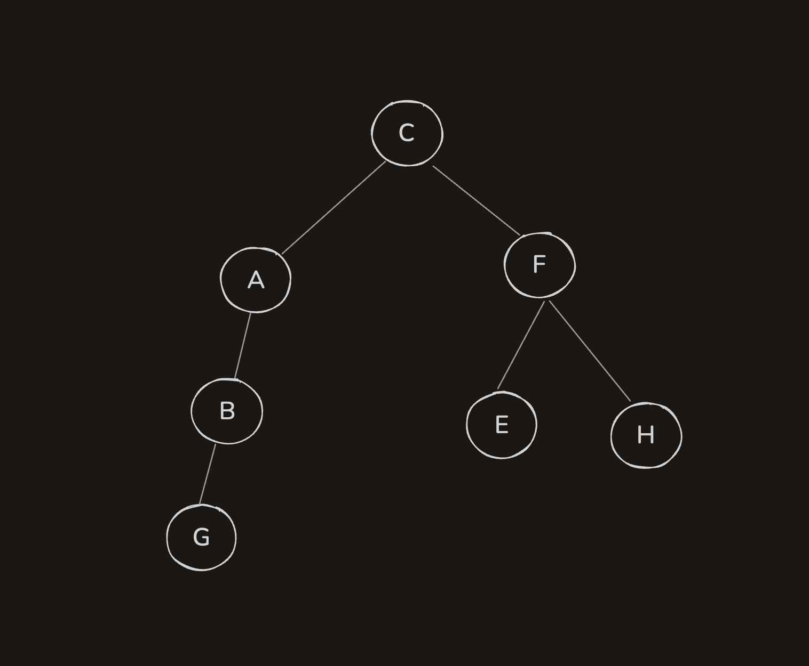
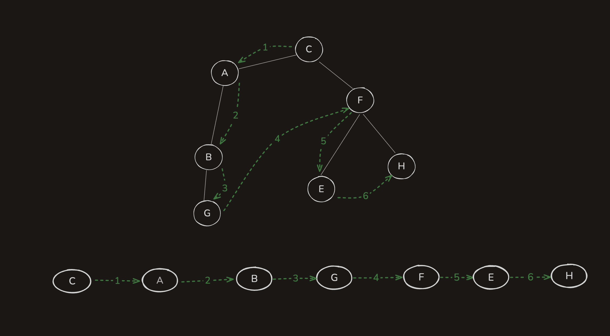
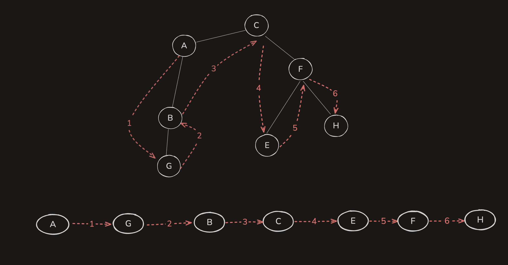
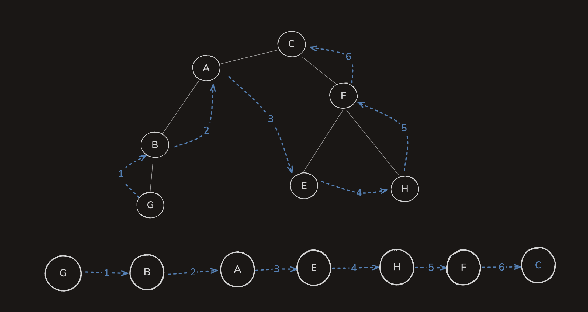

# 二叉树

## 二叉树的定义

二叉树是一种特殊的树结构，其中每个节点最多有两个子节点，分别称为左子节点和右子节点。二叉树在计算机科学中有广泛的应用，包括数据存储、查找和排序等。
二叉树是一种递归定义的数据结构。一棵二叉树可以是空的，或者由一个根节点和两棵互不相交的左子树和右子树组成。

## 二叉树的性质

1. **节点数**:

   - 如果一棵二叉树的深度为 h，则该二叉树最多有 \(2^h - 1\) 个节点。
   - 如果一棵二叉树有 n 个节点，则其深度至少为 \(\lceil \log_2(n+1) \rceil\)。

2. **满二叉树**:

   - 所有层都被完全填满的二叉树。

3. **完全二叉树**:
   - 除了最后一层外，其他层都被完全填满，并且最后一层的节点都尽可能靠左。

## 二叉树的类型

1. **满二叉树**:

   - 所有层都被完全填满的二叉树。

2. **完全二叉树**:

   - 除了最后一层外，其他层都被完全填满，并且最后一层的节点都尽可能靠左。

3. **平衡二叉树**:
   - 每个节点的左右子树的高度差不超过 1。

**图形就是含有环形的链表，常用判断最优路径**

## 树是特殊的图形 验证二叉搜索树

- 做一次中序遍历 时间复杂度 o(n)
  ```js
  function isValisBST(root) {
    let stack = []
    let inorder = -Infinity
    while (root !== null || stack.length) {
      while (root !== null) {
        stack.push(root)
        root = root.left
      }
      root = stack.pop()
      if (root.val <= inorder) {
        return false
      }
      inorder = root.val
      root = root.right
    }
    return true
  }
  ```
- 递归 时间复杂度 o(n)
  ```js
  function isValidBST(root, min = -Infinity, max = Infinity) {
    return (
      root === null ||
      (root.val > min &&
        root.val < max &&
        isValidBST(root.left, min, root.val) &&
        isValidBST(root.right, root.val, max))
    )
  }
  ```

## 二叉树的最近公共祖先

在二叉树中查找两个节点的最近公共祖先，可以使用递归的方法。具体步骤如下：

1. 如果当前节点为空，返回 `null`。
2. 如果当前节点是 `p` 或 `q`，返回当前节点。
3. 递归查找左子树和右子树。
4. 如果左子树和右子树都找到了 `p` 或 `q`，则当前节点为最近公共祖先。
5. 如果只有一边找到了 `p` 或 `q`，则返回找到的那个节点。

```js
function lowestCommonAncestor(root, p, q) {
  if (root === null || root === p || root === q) {
    return root
  }

  const left = lowestCommonAncestor(root.left, p, q)
  const right = lowestCommonAncestor(root.right, p, q)

  if (left !== null && right !== null) {
    return root // p 和 q 分别在左右子树中
  }

  return left !== null ? left : right // 返回非空的子树结果
}
```

## 二叉树遍历

```js
const binaryTree = {
  C: {
    left: 'A',
    right: 'F'
  },
  A: {
    left: 'B',
    right: null
  },
  B: {
    left: 'G',
    right: null
  },
  F: {
    left: 'E',
    right: 'H'
  },
  E: {
    left: null,
    right: null
  },
  H: {
    left: null,
    right: null
  },
  G: {
    left: null,
    right: null
  }
}

// 定义一个函数将扁平化结构转换为嵌套结构
function flattenToNested(binaryTree, rootKey) {
  if (!binaryTree[rootKey]) return null
  const node = binaryTree[rootKey]
  return {
    value: rootKey,
    left: flattenToNested(binaryTree, node.left),
    right: flattenToNested(binaryTree, node.right)
  }
}

console.log(JSON.stringify(flattenToNested(binaryTree, 'C'), null, 2))

{
  "value": "C",
  "left": {
    "value": "A",
    "left": {
      "value": "B",
      "left": {
        "value": "G",
        "left": null,
        "right": null
      },
      "right": null
    },
    "right": null
  },
  "right": {
    "value": "F",
    "left": {
      "value": "E",
      "left": null,
      "right": null
    },
    "right": {
      "value": "H",
      "left": null,
      "right": null
    }
  }
}

```



1. **前序遍历（Pre-order）**:

   - 顺序：根节点 -> 左子树 -> 右子树。
   - 优势：适用于复制树结构，生成前缀表达式。
   - 劣势：不适合查找特定节点。

   ```js
   function preOrderTraversal(node) {
     if (node === null) return
     console.log(node.value) // 访问根节点
     preOrderTraversal(node.left) // 遍历左子树
     preOrderTraversal(node.right) // 遍历右子树
   }
   ```



2. **中序遍历（In-order）**:

   - 顺序：左子树 -> 根节点 -> 右子树。
   - 优势：对于二叉搜索树（BST），按升序访问节点。
   - 劣势：不适合查找特定节点。

   ```js
   function inOrderTraversal(node) {
     if (node === null) return
     inOrderTraversal(node.left) // 遍历左子树
     console.log(node.value) // 访问根节点
     inOrderTraversal(node.right) // 遍历右子树
   }
   ```

   

3. **后序遍历（Post-order）**:

   - 顺序：左子树 -> 右子树 -> 根节点。
   - 优势：适用于删除树结构，生成后缀表达式。
   - 劣势：不适合查找特定节点。

   ```js
   function postOrderTraversal(node) {
     if (node === null) return
     postOrderTraversal(node.left) // 遍历左子树
     postOrderTraversal(node.right) // 遍历右子树
     console.log(node.value) // 访问根节点
   }
   ```

   

- 常用： 广度优先遍历&深度优先遍历

```

```

## 什么是波兰表达式

波兰表达式也称为前缀表达式，逆波兰表达式也称为后缀表达式。以表达式 (1 + 2) \* (3 + 4) 为例，这个表达式称为中缀表达式。

| 表达       | 描述                                                     |          结果          |
| :--------- | :------------------------------------------------------- | :--------------------: |
| 前缀表达式 | 不含括号的的算数表达式，将运算符写在前面，操作数写在后面 |     \* + 1 2 + 3 4     |
| 中缀表达式 | 必须含括号，操作符处于操作数的中间                       | ( 1 + 2 ) \* ( 3 + 4 ) |
| 后缀表达式 | 不含括号，运算符放在两个运算对象的后面。                 |     1 2 + 3 4 + \*     |

参考链接：[https://blog.csdn.net/zcs425171513/article/details/118310303]
