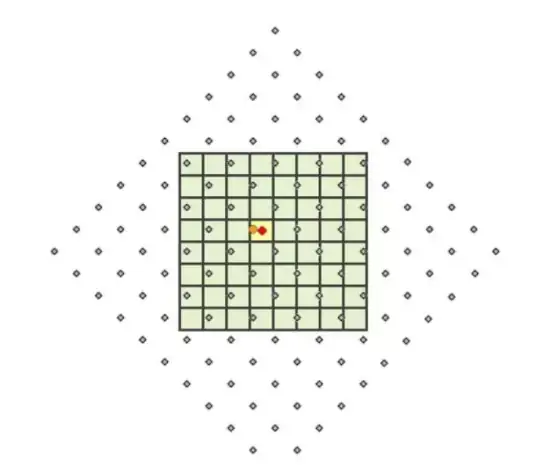

# 栅格图形系统



## 基本概念

栅格图形（Raster Graphics）也称为位图（Bitmap），是由像素点阵组成的图像。每个像素都包含颜色信息，整体构成完整的图像。

## 主要特点

### 1. 像素构成

```js
// 像素矩阵示例
const pixels = [
  [255, 0, 0], // 红色像素
  [0, 255, 0], // 绿色像素
  [0, 0, 255] // 蓝色像素
]
//由固定数量的像素组成由固定数量的像素组成由固定数量的像素组成由固定数量的像素组成由固定数量的像素组成由固定数量的像素组成由固定数量的像素组成由固定数量的像素组成由固定数量的像素组成由固定数量的像素组成由固定数量的像素组成由固定数量的像素组成由固定数量的像素组成由固定数量的像素组成
```

- 由固定数量的像素组成
- 每个像素都有特定的颜色值
- 分辨率决定图像质量

### 2. 颜色深度

- 8 位：256 种颜色
- 16 位：65,536 种颜色
- 24 位：1600 万种颜色
- 32 位：带透明通道的真彩色

### 3. 图像格式

1. **无损格式**

   - PNG：支持透明度
   - GIF：支持动画
   - BMP：无压缩原始格式

2. **有损格式**
   - JPEG：适合照片
   - WebP：Google 开发的现代格式
   - AVIF：新一代图像格式

## 技术特点

### 1. 分辨率依赖

```js
// 图像尺寸计算
const width = 1920 // 像素宽度
const height = 1080 // 像素高度
const totalPixels = width * height // 总像素数
const bytesPerPixel = 3 // RGB每像素3字节
const fileSize = totalPixels * bytesPerPixel // 文件大小（未压缩）
```

- 放大会失真
- 缩小可能丢失细节
- 文件大小与分辨率直接相关

### 2. 内存占用

```js
// 内存占用计算
const imageWidth = 1000
const imageHeight = 800
const bytesPerPixel = 4 // RGBA
const memoryUsage = imageWidth * imageHeight * bytesPerPixel // 字节数
```

- 与图像尺寸成正比
- 与颜色深度相关
- 需要考虑内存管理

### 3. 图像处理

```js
// Canvas 图像处理示例
const canvas = document.createElement('canvas')
const ctx = canvas.getContext('2d')

// 调整亮度
ctx.filter = 'brightness(150%)'

// 模糊效果
ctx.filter = 'blur(5px)'

// 灰度转换
ctx.filter = 'grayscale(100%)'
```

## 应用场景

### 1. 照片处理

- 数码相机图像
- 照片编辑
- 图像存储

### 2. 游戏图形

```js
// 游戏精灵图示例
const sprite = {
  x: 0,
  y: 0,
  width: 32,
  height: 32,
  frameCount: 8,
  currentFrame: 0
}
```

- 游戏贴图
- 精灵动画
- 背景图像

### 3. UI 设计

- 图标和按钮
- 背景纹理
- 界面装饰

## 优缺点

### 1. 优点

- 表现力强
- 真实感好
- 适合复杂图像
- 硬件加速支持好

### 2. 缺点

- 缩放质量受限
- 文件体积较大
- 编辑不够灵活
- 不适合简单图形

## 性能优化

### 1. 图像压缩

[图片压缩插件- imageCompression](#JS图片压缩插件)

```js
// 图像压缩示例
async function compressImage(file) {
  const options = {
    maxSizeMB: 1,
    maxWidthOrHeight: 1920,
    useWebWorker: true
  }
  try {
    const compressedFile = await imageCompression(file, options)
    return compressedFile
  } catch (error) {
    console.log(error)
  }
}
```

### 2. 响应式图像

```html
<picture>
  <source media="(min-width: 800px)" srcset="large.jpg" />
  <source media="(min-width: 400px)" srcset="medium.jpg" />
  
</picture>
```

### 3. 懒加载

```html

```

## 最佳实践

### 1. 格式选择

- 照片使用 JPEG
- 需要透明度使用 PNG
- 动画使用 GIF 或 WebP
- 考虑使用现代格式(WebP/AVIF)

### 2. 尺寸优化

```js
// 计算最佳尺寸
function calculateOptimalSize(originalWidth, originalHeight, maxWidth) {
  const ratio = originalHeight / originalWidth
  const width = Math.min(originalWidth, maxWidth)
  const height = Math.round(width * ratio)
  return { width, height }
}
```

### 3. 加载策略

- 使用 CDN
- 实现懒加载
- 提供响应式版本
- 使用适当的压缩

## JS图片压缩插件

imageCompression 是一个用于在浏览器中压缩图片的 JavaScript 库，它可以在上传前压缩图片，减少传输数据量。

## 基本使用

### 1. 安装

```bash
npm install browser-image-compression
# 或
yarn add browser-image-compression
```

### 2. 基础示例

```js
import imageCompression from 'browser-image-compression'

async function compressImage(file) {
  const options = {
    maxSizeMB: 1, // 压缩后最大文件大小
    maxWidthOrHeight: 1920, // 最大宽度或高度
    useWebWorker: true // 使用 Web Worker 进行压缩
  }

  try {
    const compressedFile = await imageCompression(file, options)
    console.log('原始文件大小：', file.size / 1024 / 1024, 'MB')
    console.log(
      '压缩后文件大小：',
      compressedFile.size / 1024 / 1024,
      'MB'
    )
    return compressedFile
  } catch (error) {
    console.error('压缩失败:', error)
  }
}
```

## 高级配置

### 1. 完整配置选项

```js
const options = {
  maxSizeMB: 1, // 压缩后的最大文件大小
  maxWidthOrHeight: 1920, // 最大宽度/高度
  useWebWorker: true, // 使用 Web Worker
  maxIteration: 10, // 最大压缩次数
  exifOrientation: -1, // EXIF 方向
  onProgress: (progress) => {}, // 压缩进度回调
  initialQuality: 0.7, // 初始压缩质量
  fileType: 'image/jpeg' // 输出文件类型
}
```

### 2. 带进度监控的示例

```js
async function compressWithProgress(file) {
  const options = {
    maxSizeMB: 1,
    maxWidthOrHeight: 1920,
    useWebWorker: true,
    onProgress: (progress) => {
      console.log('压缩进度：', progress)
      // 更新UI进度条
      updateProgressBar(progress)
    }
  }

  try {
    const result = await imageCompression(file, options)
    return result
  } catch (error) {
    console.error('压缩失败:', error)
  }
}
```

## 实际应用场景

### 1. 图片上传前压缩

```js
async function handleImageUpload(event) {
  const file = event.target.files[0]

  // 检查文件大小
  if (file.size > 1024 * 1024) {
    // 大于1MB时压缩
    const compressed = await compressImage(file)
    uploadToServer(compressed)
  } else {
    uploadToServer(file)
  }
}

// 文件上传
function uploadToServer(file) {
  const formData = new FormData()
  formData.append('image', file)

  fetch('/upload', {
    method: 'POST',
    body: formData
  })
}
```

### 2. 批量图片处理

```js
async function handleMultipleImages(files) {
  const options = {
    maxSizeMB: 1,
    maxWidthOrHeight: 1920
  }

  const compressPromises = Array.from(files).map((file) =>
    imageCompression(file, options)
  )

  try {
    const compressedFiles = await Promise.all(compressPromises)
    return compressedFiles
  } catch (error) {
    console.error('批量压缩失败:', error)
  }
}
```

## 最佳实践

### 1. 根据设备性能调整

```js
function getCompressionOptions() {
  const isMobile = /iPhone|iPad|iPod|Android/i.test(navigator.userAgent)

  return {
    maxSizeMB: isMobile ? 0.5 : 1,
    maxWidthOrHeight: isMobile ? 1280 : 1920,
    useWebWorker: true,
    initialQuality: isMobile ? 0.5 : 0.7
  }
}
```

### 2. 错误处理

```js
async function safeImageCompression(file) {
  try {
    // 检查文件类型
    if (!file.type.startsWith('image/')) {
      throw new Error('不是有效的图片文件')
    }

    const options = getCompressionOptions()
    const compressed = await imageCompression(file, options)

    // 验证压缩结果
    if (compressed.size >= file.size) {
      console.warn('压缩后文件更大，使用原文件')
      return file
    }

    return compressed
  } catch (error) {
    console.error('压缩过程出错:', error)
    throw error
  }
}
```
