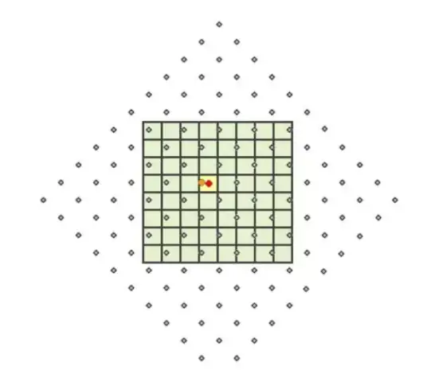

# SVG 是什么？

## 1.svg 是什么？

- **Scalable Vector Graphics** 缩放矢量图形 svg 是一种用于描述 2D 图形的标记语言。 是 XML 标记语言的衍生/一种应用层，用来描述矢量图像。

## 2.计算机得两大图型系统

1. **栅格图形系统**：由像素组成 图像表示为图片元素或者像素的长方形数组，每个像素都由红绿蓝三个颜色值表示，每个像素都由一个整数表示，这个整数的取值范围是 0-255，0 表示黑色，255 表示白色。或者是颜色表里面的索引值表示。这一系列的像素组也称之为位图（bitmap）。
2. **向量图形系统**：由线段组成，图像表示为线段元素或者线段数组，每个线段由两个点组成，每个点由一个坐标表示，坐标的取值范围是 0-1，0 表示最左上角，1 表示最右下角。
